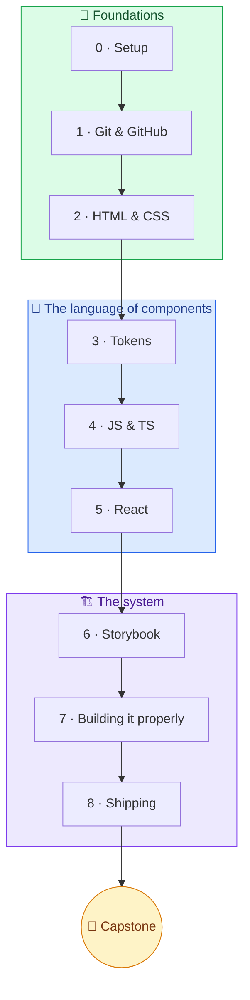
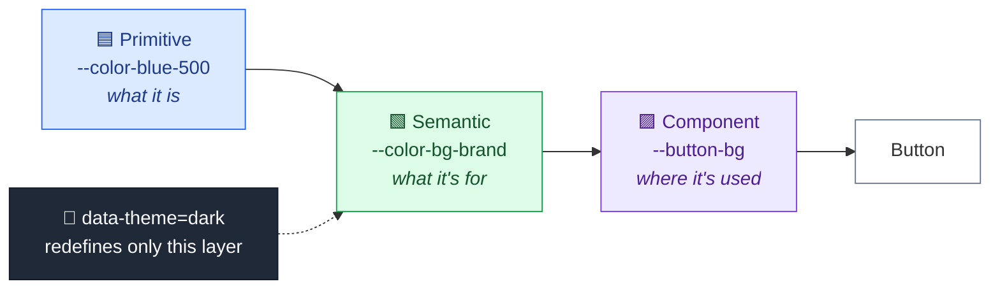
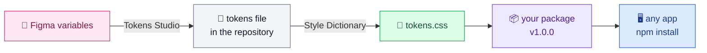

<div align="center">

# 🎨 → 💻 Design systems from the code side

**A study plan for a designer who already builds design systems in Figma
and wants to understand, read, and write the code version of the same thing.**


</div>

---

## 🗺️ The route

Three phases, nine modules, one project you build the whole way through.



| | Module | You learn | You build | Solo | Pair |
|:-:|---|---|---|:-:|:-:|
| 🧭 | **0 · Setup and mental model** | What a browser does with a page; the six terminal commands | A working machine | 3 h | 45 min |
| 🌿 | **1 · Git and GitHub** | Branches, commits, pull requests, reading a diff | Your repository, your first PR | 5 h | 45 min |
| 🎨 | **2 · HTML and CSS** | Box model, flexbox, which rule wins, CSS variables | A static button and card, styled only from variables | 8 h | 45 min |
| 🎯 | **3 · Design tokens in code** | Three tiers, why the semantic layer themes, naming | Your Figma variables as `tokens.css`, light + dark | 6 h | 45 min |
| ⚙️ | **4 · Just enough JS and TS** | Enough to read a component, no more | A tiny typed helper | 8 h | 45 min |
| ⚛️ | **5 · React and components** | Components, props, children, state | Button, Badge, Card | 10 h | 45 min |
| 📖 | **6 · Storybook** | Stories, controls, docs, accessibility checks, publishing | A live Storybook with a theme switch | 8 h | 45 min |
| 🏗️ | **7 · Building it properly** | Component anatomy, accessibility, headless libraries | TextField, Dialog, Select | 12 h | 45 min |
| 🚀 | **8 · Shipping and governance** | Packages, version numbers, the Figma → code pipeline | Version 1.0.0, installed in another project | 6 h | 45 min |
| 🏁 | **Capstone** | | Demo it as if onboarding an engineer | | 45 min |

---

## 📌 How to use this

You already know what a design system *is*. You know components, variants, properties,
variables, modes, and library publishing better than most engineers do. This plan does not
teach you design systems. It gives you the code words for things you already understand,
and then has you build a small real one.

> [!NOTE]
> **One project, start to finish.** From Module 5 onward you build a single small design
> system from your own Figma file. Every later module adds to it. By the end it is something
> other projects can install and use, with a live component catalogue.

> [!NOTE]
> **Pacing.** Each module has a rough hour estimate for the solo work. At four to six hours a
> week the whole plan takes roughly ten to twelve weeks. Do the modules in order. Each one
> assumes only what came before it.

> [!IMPORTANT]
> **Jarrod.** He is a frontend engineer and is available for questions while you do this.
> Each module ends with a **🤝 Pair on** session of about forty-five minutes, built around
> things you cannot practise alone: having your work reviewed, untangling a change that
> collides with someone else's, being handed a bug to find.
>
> The one rule for pairing is that **you drive the keyboard**. He talks, you type.

> [!IMPORTANT]
> **Concepts here, mechanics from Jarrod.** This plan explains ideas. Where a step is fiddly
> setup or configuration rather than an idea, it says *"ask Jarrod"* rather than explaining
> every detail. Take that literally. Those steps are copy-and-paste for him and a wall for
> you, and there is nothing to learn from the wall.

> [!TIP]
> **Type it yourself.** When a tutorial or an AI assistant gives you code, type it rather
> than paste it. It feels slow. It is how the words stick. Using Claude or ChatGPT as a
> line-by-line tutor is a genuinely good idea. *"Explain what each line of this file does"*
> is the question to ask, over and over.

> [!TIP]
> **Tick the boxes.** Each module ends with a ✅ **You can now** checklist. If you can't
> tick them all, stay on the module. That list is also the agenda for the pairing session.
> Any word that sounds like engineering is in the glossary at the end. Look it up, keep going.

---

## 🧱 Why we build this ourselves instead of using a component library

You will hear people suggest starting with a ready-made component library like MUI. We are
not doing that, for one reason: it hides exactly the part you are here to learn.

A design system in code has two halves. The **tokens** (colour, spacing, type, radius,
shadow) and the **components** that use them. In the browser, tokens are written as
**CSS variables**: a named value you define once and refer to everywhere, exactly like a
Figma variable. They map one-to-one onto what you already do:

| In Figma | In code |
|---|---|
| A variable collection of primitives | A list of variables like `--color-blue-500` |
| Semantic aliases like `bg/brand`, `text/primary` | Variables that point at those primitives |
| A Light / Dark mode | A small block of CSS that changes only the semantic layer |

When you write that yourself you see all three layers, and you see a theme change ripple
through. A ready-made library wraps the same idea in its own machinery, so you would learn
that library's way of doing things rather than the idea underneath.

This is not a toy approach. GitHub's Primer, Adobe's Spectrum, Atlassian's design system,
Radix Themes, and shadcn/ui all work this way. MUI itself moved to CSS variables in its
sixth version. Nothing you learn here is throwaway.

> [!WARNING]
> **One refinement.** We build the **look** of everything ourselves, but we do not build the
> **behaviour** of the hard interactive components. A dialog or a dropdown has strict
> keyboard, focus, and screen-reader rules that take specialists months to get right. In
> Module 7 you will use a *headless* library, which provides the behaviour and no styling
> at all, and you will style it entirely with your own tokens. That is exactly how shadcn/ui
> is built.

---

## 🔁 Figma to code: the glossary

> [!TIP]
> Keep this open. Almost everything in the plan is one of these rows.

Two words first. A **prop** (short for property) is an input to a component, exactly like a
component property in Figma. An **attribute** is a label you attach to an element on the
page, which CSS can then target.

| 🎨 Figma | 💻 Code |
|---|---|
| Component | A React component, which is a function that returns a piece of UI |
| Variant property, e.g. Size: sm / md / lg | A prop that only accepts a fixed list of words, written onto the element as a `data-size` attribute so CSS can style each value |
| Boolean property | A prop that is true or false |
| Text property | A prop that holds text |
| Instance swap or slot | `children`, the content placed between a component's opening and closing tags, or a named prop like `icon` |
| Variable (primitive) | A CSS variable, `--color-blue-500` |
| Variable alias (semantic) | A CSS variable that points at another, `--color-bg-brand: var(--color-blue-500)` |
| Variable collection mode (Light / Dark) | A block of CSS that applies when the page is marked `data-theme="dark"` and redefines the semantic variables |
| Text style | A set of typography tokens plus a class or component that applies them together |
| Auto layout | Flexbox, the CSS layout mode |
| Constraints and responsive resizing | CSS grid, flex, and media queries (rules that apply at certain screen sizes) |
| Component set with its property panel | A component plus its Storybook stories and controls |
| Library publish and version | Publishing the package with a version number |
| Figma branch and merge | Git branch and pull request |
| File version history | Git history |
| Dev Mode / Code Connect | Storybook, plus a Code Connect link from each Figma component to its code component |

---

<br/>

# 🌱 Phase 1 · Foundations


The tools, the vocabulary, and the two languages every component ends up in.

---

## 🧭 Module 0 · Setup and mental model


> Nothing in the later modules is hard, but all of it is impossible if the tools aren't
> installed and you don't have a picture of what a browser actually does with a web page.

### 💡 Concepts

- **A web page is three things the browser reads.** HTML (the structure, what is on the
  page), CSS (the appearance), and JavaScript (the behaviour, what happens when you click).
  Everything else in this plan, React and Storybook included, is a tool for *producing*
  those three.
- **The terminal** is a text way of doing what Finder does. You need six commands, no more.

  | Command | What it does |
  |---|---|
  | `cd` | go into a folder |
  | `ls` | list what's here |
  | `npm install` | download the code libraries a project needs |
  | `npm run dev` | start the project |
  | <kbd>Ctrl</kbd> + <kbd>C</kbd> | stop it |
  | <kbd>↑</kbd> | repeat the last command |

- **DevTools** is the browser's inspector. It is the single most useful tool you will learn.
  Right-click anything on any site, choose Inspect, and you see its HTML and the CSS
  applied to it. You can edit both live, and nothing you do there is saved.

### 📦 Install

- [VS Code](https://code.visualstudio.com/), the editor you will write code in.
- [Node.js](https://nodejs.org/). Pick the version labelled **LTS**, which means the stable one.
  This gives you `npm`, the tool that downloads code libraries.
- **Git.** On a Mac, open Terminal, type `git --version`, and accept the prompt to install the
  developer tools.
- [GitHub Desktop](https://desktop.github.com/), a visual app for Git.
- A GitHub account if you don't have one.

### 🛠️ Do

1. Open a site you know well. Right-click a button, Inspect. Find its background colour in
   the Styles panel and change it. Change the padding. Watch the page update.
2. In the Styles panel, look for anything that starts with `--`. Those are CSS variables.
   Click the value and see where it is defined.
3. Open Terminal. `cd` into your Documents folder. `ls`. Make a folder for this course.

> [!IMPORTANT]
> **🤝 Pair on.** Do the installs together so a stuck installer doesn't eat your first
> evening. Then Jarrod gives you a fifteen-minute DevTools tour on a product you both know.

### ✅ You can now

- [ ] Open DevTools, select an element, and change its styles live.
- [ ] Open Terminal, move into a folder, and list its contents.

<details>
<summary>📚 Resources</summary>

- [Chrome DevTools docs](https://developer.chrome.com/docs/devtools/), just the Elements
  and Styles pages.

</details>

---

## 🌿 Module 1 · Git and GitHub


> Every design system in code lives in a Git **repository** (a project folder whose every
> change is tracked) on GitHub. Every change to it arrives as a pull request. If you can
> read a pull request and open one, you can take part in the system rather than hand
> designs over the wall.

### 💡 Concepts

- **Version control** is Figma's version history, but deliberate. A **commit** is a save
  point you create on purpose, with a message saying what changed and why.
- **Local and remote.** The copy on your laptop is local. The copy on GitHub is remote.
  **Push** sends your commits up. **Pull** brings other people's commits down.
- **Branch** is exactly a Figma branch. You work off to the side, then merge back.
- **Pull request** (PR) is the request to merge a branch. It shows the changes, holds the
  discussion, and is where review happens. Engineers spend a lot of their day here.
- **Diff** is the before-and-after view of a change. 🟩 Green was added, 🟥 red was removed.
  Reading one calmly is a skill in itself.
- **Merge conflict** is when two people changed the same lines and Git asks a human to
  choose. It looks scary and is not.

### 🛠️ Do

1. Take the GitHub Skills course
   [Introduction to GitHub](https://github.com/skills/introduction-to-github). It runs
   inside GitHub and takes about an hour.
2. In GitHub Desktop: create a new repository called `design-system` in your course
   folder. Add a file called `README.md` with one paragraph about what you are going to
   build. Commit it. Publish it to GitHub.
3. Still in Desktop: make a branch called `readme-goals`, add a Goals section to the
   README, commit, push, and open a pull request on GitHub. Read your own diff. Merge it.
4. Now do exactly the same thing from Terminal. Ask Jarrod for the five commands and type
   them yourself. The point is to hear the words while doing the thing.

> [!IMPORTANT]
> **🤝 Pair on.** Jarrod opens a pull request against *your* repository. You review it,
> leave a comment, ask for a change, and merge once he has made it. Then he creates a merge
> conflict on purpose and you resolve it while he explains what Git is asking you.

### ✅ You can now

- [ ] Make a branch, commit, push, and open a pull request.
- [ ] Read a diff and say in plain words what changed.
- [ ] Explain local and remote to someone else.

<details>
<summary>📚 Resources</summary>

- [GitHub Skills](https://skills.github.com/), the other beginner courses when you want them.
- GitHub Desktop's own built-in tutorial repository.

</details>

---

## 🎨 Module 2 · HTML and CSS with design-system eyes


> Whatever tool builds a component, it ends up as HTML styled by CSS. Tokens are CSS.
> Variants are CSS. If you understand how CSS decides which rule wins, you understand why
> token layering works at all.

### 💡 Concepts

- **Meaningful HTML.** A `<button>` is a button. A `<div>` (a plain box) styled to look
  like one is not: no keyboard support, no name for a screen reader, no focus. This is the
  first accessibility lesson and the most important one.
- **Box model.** Content, padding, border, margin. Padding is auto layout's inner padding.
  Margin is the gap outside.
- **Flexbox** is auto layout. Direction, gap, alignment, distribution. You will feel at
  home within an hour.
- **Which rule wins.** When two CSS rules target the same element, the more specific one
  wins, and among equals the later one wins. This is called the cascade. It is why a dark
  theme block can override the defaults, and why you will never need `!important`, the
  CSS sledgehammer.
- **CSS variables.** Write `--name: value` to define one, `var(--name)` to use it. They
  flow down the page, so defining them at the very top (the `:root` rule, meaning the page
  itself) makes them available everywhere, and redefining them on any element re-themes
  everything inside that element.
- **Attributes.** Extra labels on an element. Ones that start with `data-` are labels you
  invent, like `data-variant="primary"`. CSS can target them, which is how variants work.
- **States.** `:hover`, `:active`, `:disabled`, and `:focus-visible`. The last one is the
  keyboard focus ring. Never remove it. Style it.
- **Units.** Use `rem` for type and spacing so the whole system scales with the user's
  font-size setting. `px` for borders and hairlines.
- **Media queries** are rules that only apply in some conditions: screen width, or the
  OS dark-mode setting via `prefers-color-scheme`.

### 🛠️ Do

Build a single static page, a file called `index.html` plus one called `styles.css`, with:

1. Every colour, spacing value, radius, and font size declared once at the top as a
   variable. No raw values anywhere else in the file.
2. A button in three variants (primary, secondary, ghost) using a `data-variant` attribute,
   with a CSS rule for each value.
3. Hover, active, disabled, and focus-visible states for all three.
4. A card with a title, body, and the button inside it, laid out with flexbox.
5. Change one variable at the top and watch everything that depends on it move.

Commit as you go, on a branch, and merge with a pull request when done. This is your
habit now.

> [!IMPORTANT]
> **🤝 Pair on.** Open GitHub itself in DevTools. It is built on Primer, which uses CSS
> variables throughout. Pick a button, find its background colour, and trace it back through
> the rules to the variable that defines it and the place that variable is set. Then Jarrod
> breaks your page on purpose so a style stops applying, and you work out why.

### ✅ You can now

- [ ] Build a static component with variants and states using only variables.
- [ ] Explain why a rule did or didn't apply by reading the Styles panel.
- [ ] Say why a `<button>` and a styled `<div>` are not interchangeable.

<details>
<summary>📚 Resources</summary>

- [MDN Learn web development](https://developer.mozilla.org/en-US/docs/Learn_web_development),
  the HTML and CSS core modules.
- [web.dev Learn CSS](https://web.dev/learn/css), especially Box Model, Selectors,
  Cascade, Specificity, Inheritance, and Flexbox.

</details>

---

<br/>

# 🧩 Phase 2 · The language of components


Tokens as code, just enough JavaScript to read a component, and then components themselves.
Your Figma expertise does most of the work in this phase.

---

## 🎯 Module 3 · Design tokens in code


> This is the module where your expertise and the code meet. Token architecture is a design
> decision that happens to be written in CSS, and you are better placed to make it than
> most engineers.

### 💡 Concepts



- **Three tiers.** Primitive (`--color-blue-500`, what it *is*), semantic
  (`--color-bg-brand`, what it's *for*), and component (`--button-bg`, where it's *used*).
  Components should only ever use semantic or component tokens. Never primitives.
- **The semantic layer is the one that themes.** Dark mode does not change what blue-500
  is. It changes what `bg-canvas` points to. This is the whole trick.
- **Naming.** Consistent, predictable, and mirrored to your Figma variable names so the
  two never drift. Read Nathan Curtis on this before you name anything.
- **A shared file format.** The Design Tokens Community Group (DTCG) publishes a standard
  way to write tokens in a plain text file, so a Figma plugin can export them and a code
  tool can read them. You will hand-write CSS in this module and automate that step in
  Module 8.

A minimal token file looks like this. Note the primitives first, then the semantic aliases,
then the dark theme redefining only the semantic layer:

```css
:root {
  /* Primitives: named by what they are */
  --color-blue-500: #2563eb;
  --color-blue-600: #1d4ed8;
  --color-grey-0: #ffffff;
  --color-grey-100: #f3f4f6;
  --color-grey-900: #111827;

  --space-1: 0.25rem;
  --space-2: 0.5rem;
  --space-3: 0.75rem;
  --space-4: 1rem;

  --radius-md: 0.5rem;
  --font-size-label: 0.875rem;
  --font-size-body: 1rem;

  /* Semantic: named by what they are for. This is the layer that themes. */
  --color-bg-canvas: var(--color-grey-0);
  --color-bg-subtle: var(--color-grey-100);
  --color-text-primary: var(--color-grey-900);
  --color-bg-brand: var(--color-blue-500);
  --color-bg-brand-hover: var(--color-blue-600);
  --color-text-on-brand: var(--color-grey-0);
}

[data-theme="dark"] {
  --color-bg-canvas: var(--color-grey-900);
  --color-bg-subtle: #1f2937;
  --color-text-primary: var(--color-grey-0);
}
```

### 🛠️ Do

1. Open your own Figma file. For each variable collection, write the matching CSS
   variables into a file called `tokens.css`. Keep the names as close to Figma as CSS
   allows.
2. Rewrite Module 2's styles so components use only semantic tokens.
3. Add a second theme by redefining the semantic layer under `[data-theme="dark"]`.
4. Add a theme toggle. This is your first JavaScript, and it is three lines. It finds the
   button, waits for a click, and flips the `data-theme` label on the page:

```html
<button id="theme-toggle">Toggle theme</button>
<script>
  const root = document.documentElement;
  document.getElementById('theme-toggle').addEventListener('click', () => {
    root.dataset.theme = root.dataset.theme === 'dark' ? 'light' : 'dark';
  });
</script>
```

5. Write a short section in the README explaining the three tiers and your naming rules.
   You will be glad of this later.

> [!IMPORTANT]
> **🤝 Pair on.** Jarrod plays an engineer who has been handed your token file to build a
> settings page. What is missing? What is ambiguous? Which names would he rename, and why?
> Give this a full session. It is the conversation the two disciplines rarely get to have.

### ✅ You can now

- [ ] Explain the three tiers and why only the semantic one themes.
- [ ] Look at any raw value in a stylesheet and say which token it should be.
- [ ] Describe the path from a Figma variable to a CSS variable.

<details>
<summary>📚 Resources</summary>

- Nathan Curtis, [Naming Tokens in Design Systems](https://medium.com/eightshapes-llc/naming-tokens-in-design-systems-9e86c7444676).
- [Design Tokens Community Group](https://www.designtokens.org/). Skim, don't study.

</details>

---

## ⚙️ Module 4 · Just enough JavaScript and TypeScript


> React components are written in JavaScript. You need enough of the language to read one
> comfortably. You do not need to become a JavaScript developer, and this module is
> deliberately small.

### 💡 Concepts

**JavaScript**

- **Variables** (`const`, `let`) hold values: text, numbers, true/false.
- **Objects** group values by name, `{ size: 'md' }`. **Arrays** are lists,
  `['sm', 'md', 'lg']`. You read a value out with a dot, `props.size`. You do something to
  every item in a list with `.map()`.
- **Functions** are named chunks of work you can run. The short form looks like
  `(x) => x * 2`.
- **Template strings** let you build text with values in it, `` `button--${size}` ``.
- **Destructuring** pulls named values out of an object in one go,
  `const { size, variant } = props`. Every React component starts this way.
- **`import` and `export`.** Every file is its own little world. Export something to make it
  available, import it in the file that needs it. This is how components find each other.

**TypeScript** is JavaScript plus a way to describe the shape of your data.

- `type` describes what an object must contain.
- A fixed list of allowed words, written `'sm' | 'md' | 'lg'`, is a Figma variant
  property in code. The editor will refuse any other value. This is the single most useful
  thing TypeScript does for a design system.
- A question mark, `size?`, means optional.
- Red squiggles are the editor telling you a shape doesn't match. Hover the squiggle. The
  message is usually right.

> [!WARNING]
> **Skipped on purpose:** anything about `this`, classes, or `async`. If a tutorial wanders
> into those, skip ahead.

### 🛠️ Do

1. Work through the javascript.info chapters on variables, data types, functions, arrow
   functions, objects, arrays, destructuring, and modules. Do the exercises in the
   browser **console**, the tab in DevTools where you can type JavaScript and see the
   result.
2. Read the TypeScript handbook page "TypeScript for JavaScript Programmers". Just that one.
3. In your repository, create a file `tokens.ts` that exports your spacing scale as an
   object, and a small function that takes `{ size: 'sm' }` and returns the text
   `'button--sm'`. Small, but it is the exact shape of what a component does.

> [!IMPORTANT]
> **🤝 Pair on.** Jarrod opens a real component file from a codebase he works in. You read
> it line by line and say what each line does. He fills the gaps. The goal is recognition,
> not recall.

### ✅ You can now

- [ ] Read a short JavaScript file and describe what it does.
- [ ] Write a `type` for a component's props with a fixed list of variants.
- [ ] Say what an import at the top of a file is doing.

<details>
<summary>📚 Resources</summary>

- [javascript.info](https://javascript.info/), the chapters named above only.
- [TypeScript for JavaScript Programmers](https://www.typescriptlang.org/docs/handbook/typescript-in-5-minutes.html).

</details>

---

## ⚛️ Module 5 · React and components


> React is where a design system's components live for most product teams. A React
> component is the code twin of a Figma component, and the match is tighter than you might
> expect.

### 💡 Concepts

- **A component is a function** that takes props and returns a piece of UI. The
  HTML-looking code it returns is called JSX. Writing `<Button size="sm">Save</Button>`
  is calling that function.
- **Props are your Figma properties.** A variant property becomes a prop with a fixed list
  of words. A boolean property becomes a true/false prop. A text property becomes a text
  prop.
- **`children` is the slot.** Whatever goes between the opening and closing tags.
- **Composition over configuration.** A Button that accepts an icon as content is better
  than a Button with forty true/false props, one per icon. You already believe this from
  Figma.
- **State** is data that changes while the user interacts, like whether a menu is open.
  React gives a component a way to hold such a value and redraws the component when it
  changes. Design systems hold very little state. Most of it belongs to the app.
- **Showing things conditionally, and lists.** Show a dialog only when open; turn a list
  of items into a list of rows. Each row in a list needs a `key`, a unique label so React
  can tell them apart.
- **File layout.** One folder per component: the component file, its CSS, and a small
  index file that exports it. Stories join them in the next module.

Here is the Button from Module 2, now as a React component. The variant becomes a prop
written onto a `data-variant` attribute, and the CSS from Module 2 targets it unchanged:

```tsx
// src/components/Button/Button.tsx
import type { ReactNode } from 'react';
import './Button.css';

type ButtonProps = {
  variant?: 'primary' | 'secondary' | 'ghost';
  size?: 'sm' | 'md' | 'lg';
  disabled?: boolean;
  onClick?: () => void;
  children: ReactNode;
};

export function Button({
  variant = 'primary',
  size = 'md',
  disabled = false,
  onClick,
  children,
}: ButtonProps) {
  return (
    <button
      className="button"
      data-variant={variant}
      data-size={size}
      disabled={disabled}
      onClick={onClick}
    >
      {children}
    </button>
  );
}
```

> [!NOTE]
> **Reading it top to bottom.** The two `import` lines bring in a type from React and the
> CSS file. The `type ButtonProps` block is the property panel, saying which props exist,
> which values they accept, and which are optional. The `export function Button` line is
> the component itself, pulling each prop out with a default value. Everything inside
> `return` is what appears on the page. `children` is where the button label goes.

```css
/* src/components/Button/Button.css */
.button {
  font: inherit;
  border: 0;
  border-radius: var(--radius-md);
  padding-block: var(--space-2);
  padding-inline: var(--space-4);
  cursor: pointer;
}

.button[data-variant="primary"] {
  background: var(--color-bg-brand);
  color: var(--color-text-on-brand);
}

.button[data-variant="primary"]:hover {
  background: var(--color-bg-brand-hover);
}

.button[data-size="sm"] {
  padding-block: var(--space-1);
  padding-inline: var(--space-3);
  font-size: var(--font-size-label);
}

.button:focus-visible {
  outline: 2px solid var(--color-bg-brand);
  outline-offset: 2px;
}

.button:disabled {
  opacity: 0.5;
  cursor: not-allowed;
}
```

### 🛠️ Do

1. Create the project. In your course folder, run these in Terminal. The first line
   generates a starter project for you; say yes to any prompts.

```sh
npm create vite@latest design-system -- --template react-ts
cd design-system
npm install
npm run dev
```

   If you want it inside the repository you already made, create it there instead and
   commit the starter as your first pull request. Ask Jarrod if the two folders get
   confusing.

2. Copy `tokens.css` into the project's `src` folder and import it once in the main file.
   Jarrod can show you where in two minutes.
3. Build `Button` as above. Show all three variants and three sizes on the page to check
   them. Add a theme toggle that flips `data-theme` on the page, this time using React's
   state.
4. Build `Badge` (variant: neutral, success, warning, danger) and `Card` (children only,
   plus an optional `title` prop). One folder each.
5. Work through react.dev's Learn section: Quick Start, Describing the UI, and Adding
   Interactivity. Stop before Managing State and Escape Hatches. You don't need them yet.

> [!IMPORTANT]
> **🤝 Pair on.** Debugging. Jarrod plants two bugs in your Button, a misspelt prop and a
> missing `key` on a list, and you find them using the console and the React DevTools
> browser extension. Then he adds a line that prints to the console inside the component,
> clicks around, and you watch how often React redraws it.

### ✅ You can now

- [ ] Read a component file and point to its props, its variants, and where tokens enter.
- [ ] Build a small display component with typed variant props.
- [ ] Explain props versus state to another designer.

<details>
<summary>📚 Resources</summary>

- [react.dev Learn](https://react.dev/learn), the sections named above.
- [React Developer Tools](https://react.dev/learn/react-developer-tools) browser extension.

</details>

---

<br/>

# 🏗️ Phase 3 · The system


A place to see and review every component, the habits of a real component library, and
shipping it so other projects can use it.

---

## 📖 Module 6 · Storybook


> Storybook is the place where Figma and code meet for review. It shows every component in
> every state, on its own, away from any app, with a property panel that looks a lot like
> Figma's. Designers who can read a Storybook review components with precision. Designers
> who can write stories decide which states engineers have to build.

### 💡 Concepts

- **A story is one state of one component.** "Primary button", "Small primary button",
  "Disabled". A component's stories should cover its variant matrix the way your Figma
  component set does.
- **Args are props.** The Controls panel lets you change them live. It is your property
  panel.
- **Autodocs** writes a documentation page for a component from its stories and its props.
- **Decorators** wrap every story in something: a theme, some padding. A theme switch in
  the Storybook toolbar is a decorator.
- **Addons.** Extras you switch on. The accessibility addon runs automated checks on every
  story. The viewport addon previews at phone and tablet sizes.
- **Publishing.** Storybook can be turned into a folder of plain web pages and hosted for
  free, so every pull request can have a live preview link. This is how design review on
  code should work.

A story file is mostly a list. Here is the Button's:

```tsx
// src/components/Button/Button.stories.tsx
import type { Meta, StoryObj } from '@storybook/react-vite';
import { Button } from './Button';

const meta = {
  title: 'Components/Button',
  component: Button,
  tags: ['autodocs'],
  args: { children: 'Save changes', variant: 'primary', size: 'md' },
} satisfies Meta<typeof Button>;

export default meta;
type Story = StoryObj<typeof meta>;

export const Primary: Story = {};
export const Secondary: Story = { args: { variant: 'secondary' } };
export const Ghost: Story = { args: { variant: 'ghost' } };
export const Small: Story = { args: { size: 'sm' } };
export const Disabled: Story = { args: { disabled: true } };
```

> [!NOTE]
> **Reading it.** The `meta` block says which component this file is about, where it sits
> in the sidebar, and the default props. The lines mentioning `Meta` and `StoryObj` are
> boilerplate that every story file has. Copy them and move on. Then each `export const`
> is one story, and each one changes only the props that make it different from the default.

### 🛠️ Do

1. Inside the project, run this in Terminal. It asks a few questions; choose documentation
   and accessibility when it offers features.

```sh
npx storybook@latest init
```

   It creates a `.storybook` folder, some example stories to look at, and a
   `npm run storybook` command that opens Storybook in your browser.

2. Make Storybook load your `tokens.css`. Ask Jarrod where the one-line import goes.
3. Delete the example stories. Write stories for every variant and size of Button, Badge,
   and Card.
4. Add a light/dark switch to the Storybook toolbar. Ask Jarrod to set up the decorator
   with you; the idea is simply "set `data-theme` on the page from the toolbar value."
5. Open the Accessibility panel on each story. Fix at least one finding.
6. Publish. Follow the Storybook guide on publishing to GitHub Pages, with Jarrod on hand.
   Then open a pull request that changes one token and look at the change in the published
   preview.

> [!IMPORTANT]
> **🤝 Pair on.** A real code review, both directions. Jarrod reviews your Storybook pull
> request exactly as he would a colleague's: comments on specific lines, a requested change.
> You address the comments and ask for review again. Then you review a small pull request
> of his.

### ✅ You can now

- [ ] Write a story for any component and cover its variant matrix.
- [ ] Use Controls to explore a component and Accessibility to check it.
- [ ] Review a component in a published Storybook and comment on it with precision.

<details>
<summary>📚 Resources</summary>

- [Storybook docs](https://storybook.js.org/docs), the Get Started and Writing Stories sections.
- [Storybook tutorials](https://storybook.js.org/tutorials/), the Intro to Storybook (React) track.
- [Publish Storybook](https://storybook.js.org/docs/sharing/publish-storybook).
- [Chromatic](https://www.chromatic.com/), a free hosting option if GitHub Pages gets fiddly.

</details>

---

## 🏗️ Module 7 · Building the system properly


> The first three components were shaped for learning. This module introduces the habits
> engineers expect from a real component library, makes accessibility a requirement rather
> than a check, and uses a headless library for the hard interactive components.

### 💡 Concepts

- **Component anatomy.** One folder, one component: the component, its CSS, its stories,
  and its index file. Every component in the system looks the same from the outside.

  ```
  src/components/Button/
  ├── Button.tsx           the component
  ├── Button.css           its styles, reading your tokens
  ├── Button.stories.tsx   every state, for Storybook
  └── index.ts             exports it to the rest of the system
  ```

- **Component tokens.** A third tier, like `--button-bg: var(--color-bg-brand)` at the top
  of the Button's CSS. It lets someone re-skin one component without touching the
  semantic layer.
- **Two things engineers will ask for.** A way to add their own CSS class to your
  component for page layout, and a way to reach the underlying element to focus or measure
  it. Don't study these. Have Jarrod show you a real case where he needed each; the reasons
  are more memorable than the names.
- **Accessibility as a spec.** Every interactive component needs a visible focus ring, a
  keyboard path, and a name a screen reader can say. Test with the mouse unplugged.
- **Headless libraries.** Radix Primitives ships a dialog, a dropdown select, a tooltip,
  and more, each with all the behaviour and none of the styling. You style them with your
  tokens. shadcn/ui is the well-known example of exactly this pattern, and it is worth
  reading once you have built your own.

### 🛠️ Do

1. Bring Button, Badge, and Card into the standard folder layout with component tokens.
   Add the two engineer asks from the Concepts list, with Jarrod showing you the first one.
2. Build `TextField`: label, input, optional help text, optional error. The label must be
   properly linked to the input so a screen reader reads it. Stories for default, filled,
   error, and disabled.
3. Add Radix's Dialog to the project and build your `Dialog` on it, styled only with your
   tokens. Stories for open state and for a long body.
4. Build `Select` on Radix's Select the same way.
5. For each of the five components: open it in Storybook, unplug the mouse, and operate
   it. Then run the Accessibility panel.

> [!IMPORTANT]
> **🤝 Pair on.** A keyboard-only walkthrough of your Dialog and Select, then ten minutes
> with VoiceOver, the Mac screen reader, switched on. Then Jarrod explains the two engineer
> asks from the Concepts list with a real case where he needed them.

### ✅ You can now

- [ ] Explain what a headless component is and why you would use one.
- [ ] Build an accessible form field and a dialog styled entirely with your tokens.
- [ ] Say what a component's folder should contain before opening it.

<details>
<summary>📚 Resources</summary>

- [Radix Primitives](https://www.radix-ui.com/primitives), the Dialog and Select pages.
- [React Aria](https://react-spectrum.adobe.com/react-aria/), the main alternative, for comparison.
- [shadcn/ui](https://ui.shadcn.com/), read the Button and Dialog once yours exist.
- [W3C accessibility fundamentals](https://www.w3.org/WAI/fundamentals/accessibility-intro/).

</details>

---

## 🚀 Module 8 · Shipping and governance


> A design system nobody can install is a folder of components. This module turns your
> project into a **package**, a bundle of code other projects can install by name, and
> closes the loop back to Figma with an automated token pipeline.

### 💡 Concepts



- **Package.** A file called `package.json` names the package, its version, and what it
  offers. An app installs it with one command and imports from it exactly as it imports
  from React. Publishing a package is publishing a Figma library.
- **Version numbers.** MAJOR.MINOR.PATCH, a convention called semantic versioning.

  | Bump | When | Example |
  |---|---|---|
  | 🟢 Patch `1.0.0 → 1.0.1` | Fixes a bug, nothing else changes | Focus ring was the wrong colour |
  | 🔵 Minor `1.0.0 → 1.1.0` | Adds something, nothing breaks | New `Tooltip` component |
  | 🔴 Major `1.0.0 → 2.0.0` | Breaks something an existing user relied on | Renaming a token |

- **Changelog and Changesets.** Every pull request that changes behaviour adds a short
  note. A tool called Changesets collects the notes at release time and picks the version
  number for you.
- **Deprecation etiquette.** Keep the old name working with a warning for one release
  before removing it. The people using your package are busy.
- **Token pipeline.** A Figma plugin called Tokens Studio exports your variables as a
  text file in the standard format. That file lives in the repository. A tool called
  Style Dictionary reads it and generates `tokens.css`. From then on nobody hand-edits
  the CSS, and Figma is the source of truth in a way it can prove.

### 🛠️ Do

1. Set up the package. Add a file that exports every component, and configure the project
   so `npm run build` produces something installable. Do this step with Jarrod; it is
   copy-and-paste configuration and there is nothing in it for you to learn.
2. Publish version `0.1.0`. Jarrod will help you pick where.
3. Create a throwaway project, install your package, and put a Button on the page. This
   moment is the point of the whole plan.
4. Install Tokens Studio in Figma. Export your variables into a `tokens` folder in the
   repository. Set up Style Dictionary, with Jarrod, to generate `tokens.css` from it.
   Delete the hand-written file and confirm nothing on screen changed.
5. Add Changesets. Make a deliberate breaking change: rename one semantic token. Write the
   note, release `1.0.0`, and update the throwaway project to the new name.

> [!IMPORTANT]
> **🤝 Pair on.** Cut the release together. Jarrod walks you through a real version-number
> call he has had to make, then you make yours the same way.

### ✅ You can now

- [ ] Say whether a given change is a patch, minor, or major, and why.
- [ ] Install and use your own package in another project.
- [ ] Describe the path from a Figma variable to a shipped CSS variable with no human in between.

<details>
<summary>📚 Resources</summary>

- [semver.org](https://semver.org/), the versioning rules.
- [Tokens Studio](https://tokens.studio/) and [Style Dictionary](https://styledictionary.com/).
- Three open-source systems to read now that you can: [Primer](https://primer.style/),
  [Spectrum](https://spectrum.adobe.com/), [Atlassian Design System](https://atlassian.design/).

</details>

---

<br/>

# 🏁 Capstone


By the end you have built, without noticing it was a capstone:

- [ ] A token layer generated from your Figma file with primitive, semantic, and component
  tiers, and light and dark themes.
- [ ] Button, Badge, Card, TextField, Dialog, and Select, each in the standard folder layout
  with typed variant props and component tokens.
- [ ] Stories covering every variant in both themes, with accessibility checks passing.
- [ ] A published Storybook and a published package at version 1.0.0.
- [ ] A repository history made entirely of pull requests.

> [!IMPORTANT]
> **🤝 Final session.** Demo it to Jarrod as if onboarding an engineer who is about to use
> the system. He reviews against the checklist in the mentor guide below.

---

<br/>

## 📎 Appendix A · Things to skip for now

Each of these is real and each is a distraction at this stage.

| Skip | Why |
|---|---|
| **Next.js** and other app frameworks | Design systems sit below the app. Vite is enough. |
| **Tailwind** | A different answer to the same problem. Learn the underlying CSS first. |
| **CSS-in-JS** (styled-components, Emotion) | Falling out of favour, and it hides the CSS. |
| **State libraries** (Redux, Zustand) | App concerns. Design systems hold almost no state. |
| **Test frameworks** beyond what Storybook gives you | Later, if ever. |
| **Build configuration and CI pipelines** | Ask Jarrod when you hit them. |
| Anything with `class extends React.Component` or `create-react-app` | That is an old tutorial. Close it. |

## 📖 Appendix B · Words you will hear

| Word | Meaning |
|---|---|
| terminal | The text-based way of running commands on your computer |
| console | The tab in DevTools where you can type JavaScript and see errors |
| repo | Short for repository: a project folder whose every change is tracked by Git |
| clone | Copy a repo from GitHub to your machine |
| main | The default branch everyone merges into |
| PR | Pull request: a proposed merge with a diff and a discussion |
| diff | The before-and-after of a change |
| merge conflict | Two changes to the same lines that Git can't combine alone |
| CI | Checks that run automatically on every pull request |
| lint | An automated style and error check on code |
| build | Turn source files into what the browser actually loads |
| bundle | The output of a build |
| package | A named bundle of code you can install into a project |
| dependency | A package your project installs and uses |
| `node_modules` | The folder those dependencies live in. Never commit it |
| script | A named command in `package.json`, run with `npm run <name>` |
| scaffold | Generate a starter project with the boring files already in place |
| semver | Semantic versioning, MAJOR.MINOR.PATCH |
| breaking change | A change that forces people using your code to alter theirs |
| element | One thing on the page: a button, a heading, a box |
| attribute | A label on an element. `data-` ones are labels you invent |
| prop | An input to a component |
| state | A value that changes over time inside a component |
| render | React drawing a component onto the page. Re-render: drawing it again |
| DOM | The browser's live tree of elements that CSS and JavaScript act on |
| hook | A function starting with `use` that gives a component a capability, like holding state |
| JSX | The HTML-looking code inside a React component |
| a11y | Accessibility. Eleven letters between a and y |
| token | A named design decision: a colour, a spacing step, a font size |
| headless | A component library that provides behaviour but no visual styling |
| boilerplate | Lines that are the same in every file. Copy them, don't study them |

<details>
<summary><h2>🧑‍🏫 Appendix C · Mentor guide (for Jarrod)</h2></summary>

Kept in the same document on purpose so there is nothing hidden about how the sessions are
meant to run.

### Ground rules

- She drives the keyboard. Every session.
- Don't fix it for her. Ask what she expected to happen, then what happened.
- Explain the why, not the incantation. "Git needs to know which branch" beats
  "type `-b`".
- Let her be stuck for ten minutes before stepping in. The stuck part is where it lands.
- When she asks "is this right?", ask what she would expect first.
- Between sessions, point at the docs page before giving the answer.
- Wherever the doc says "ask Jarrod", the step is mechanics with no concept underneath.
  Do it fast, narrate lightly, and move on. Don't turn it into a lesson.

### Per-module checkpoint questions and sticking points

| Module | Ask her | Expect trouble with |
|---|---|---|
| 🧭 0 | What are the three things a browser reads? Show me a CSS variable in DevTools. | Terminal fear. Keep it to the six commands. |
| 🌿 1 | Local vs remote? What does a PR contain? Talk me through this diff. | Forgetting to pull before branching. Fear of "losing work". Detached HEAD if she clicks around in Desktop's history. |
| 🎨 2 | Why did this rule lose? Why is a `<div>` button wrong? What does `rem` buy us? | Specificity. She will reach for `!important`. Don't let her. |
| 🎯 3 | Which tier themes and why? Which token should this raw value be? | Naming by appearance (`--blue-button`) instead of purpose. Putting primitives in components. |
| ⚙️ 4 | Read this file to me. What does this import bring in? Write me the type for Badge's props. | Panic at red squiggles. Teach "hover the error". Redirect if she wanders into `this` or async. |
| ⚛️ 5 | Props vs state? Where do tokens enter this component? Why does the list need a `key`? | Mutating state directly. Missing keys. Wanting to put state in the component that belongs in the app. |
| 📖 6 | What is a story? Args vs decorators? Show me an a11y finding and its fix. | Stale Storybook cache after config edits. Args vs decorators confusion. The `Meta`/`StoryObj` types: tell her to copy them. |
| 🏗️ 7 | What is headless and why use it? Operate this Dialog with no mouse. Why would an app need to reach the underlying element? | Styling Radix parts with the wrong selectors. Removing the focus ring "because it's ugly". `forwardRef` and `className` passthrough are yours to explain, not hers to research. |
| 🚀 8 | Patch, minor, or major, and why? Where is the source of truth for tokens now? | Library-mode build config, package exports, registry choice. Do all of it with her; it is boilerplate. |

### Capstone checklist

- [ ] Tokens have a semantic tier, and switching theme touches no component file.
- [ ] Every component's variants are typed props, not free strings.
- [ ] Stories cover every variant in both themes and the a11y panel is clean.
- [ ] Dialog and Select work with the keyboard only.
- [ ] The README explains the token tiers and naming rules.
- [ ] Repository history is pull requests, not direct pushes to `main`.
- [ ] She can demo it to an engineer and answer "why did you do it that way" for each part.

</details>
